[](https://classroom.github.com/a/vbnbTt5m)

[](https://classroom.github.com/online_ide?assignment_repo_id=15295169&assignment_repo_type=AssignmentRepo)
# Dev_Setup
Setup Development Environment

#Assignment: Setting Up Your Developer Environment

#Objective:
This assignment aims to familiarize you with the tools and configurations necessary to set up an efficient developer environment for software engineering projects. Completing this assignment will give you the skills required to set up a robust and productive workspace conducive to coding, debugging, version control, and collaboration.

#Tasks:

1. Select Your Operating System (OS):
   Choose an operating system that best suits your preferences and project requirements. Download and Install Windows 11. https://www.microsoft.com/software-download/windows11

   Step 1: Download Windows 11 Installation Media
Visit the official Windows 11 download page:

Go to Microsoft Windows 11 download page.

Click on "Download Now" to download the Windows 11 Installation Assistant.


Step 2: Run the Installation Assistant
Locate the downloaded file and double-click to run the Windows 11 Installation Assistant.


Follow the on-screen instructions to begin the installation process.


Step 3: Check System Requirements
Ensure your PC meets the minimum system requirements for Windows 11. The installation assistant will verify this.


Step 4: Backup Important Data
Before proceeding, make sure to back up any important data from your current operating system.


Step 5: Start the Installation
Click on "Accept and Install" after reading the license terms.


The installation assistant will download Windows 11 and begin the installation process.


Step 6: Installation Process
Your PC will restart several times during the installation process. This can take some time, so be patient.


Step 7: Complete the Setup
Once the installation is complete, follow the on-screen instructions to set up your new Windows 11 environment.


Step 8: Personalize Your Settings
Configure your preferences, including language, region, keyboard layout, and privacy settings.


Step 9: Sign in with a Microsoft Account
You will be prompted to sign in with your Microsoft account or create a new one.


Step 10: Finalize the Setup
Complete the final steps, including customizing your desktop and installing any necessary applications.

Part 2: GitHub Repository Setup
Step-by-Step Instructions
Step 1: Install Git
Download and install Git from the official website: Git Download.


Follow the installation instructions and use default settings.


Step 2: Initialize a Sample Project
Create a new project directory.

Open Git Bash and navigate to your project directory.


Initialize a new Git repository:

bash
Copy code
git init

Step 3: Create a Sample Project File
Create a sample file, e.g., README.md, and add some initial content.


Step 4: Create a .gitignore File
In the root of your project directory, create a .gitignore file with the following content:

bash
Copy code
# Ignore node_modules folder
node_modules/

# Ignore logs
*.log

Step 5: Commit the Initial Project Files
Add your files to the repository:

bash
Copy code
git add .

Commit the changes:

bash
Copy code
git commit -m "Initial commit"

Step 6: Create a GitHub Repository
Go to GitHub and create a new repository.

Copy the repository URL.


Step 7: Link the Local Repository to GitHub
In Git Bash, add the remote repository:

bash
Copy code
git remote add origin <repository-url>

Push your changes to GitHub:

bash
Copy code
git push -u origin main

GitHub Repository Contents
README.md: Contains basic information about the project.
.gitignore: Ensures unnecessary files are not tracked by Git.

Part 3: Reflection on Challenges and Solutions
Challenges Faced
Compatibility Issues:

Ensuring the PC meets the minimum requirements for Windows 11 was challenging due to TPM and Secure Boot settings.
Data Backup:

Ensuring all important data was backed up before installation took significant time and careful planning.
Understanding Git Commands:

For beginners, understanding and using Git commands correctly posed an initial challenge.
Strategies to Overcome Challenges
Research and Preparation:

Conducted thorough research on system requirements and prepared the PC by enabling TPM and Secure Boot in BIOS settings.
Utilized Automated Backup Tools:

Used automated backup tools to streamline the data backup process.
Learning Resources:

Leveraged online tutorials and documentation from Git's official website to understand and practice Git commands effectively.
Tools Selected
Windows 11: Chosen for its modern interface and improved security features.
Git: Essential for version control and collaboration.
GitHub: Provides a reliable platform for hosting and managing repositories.

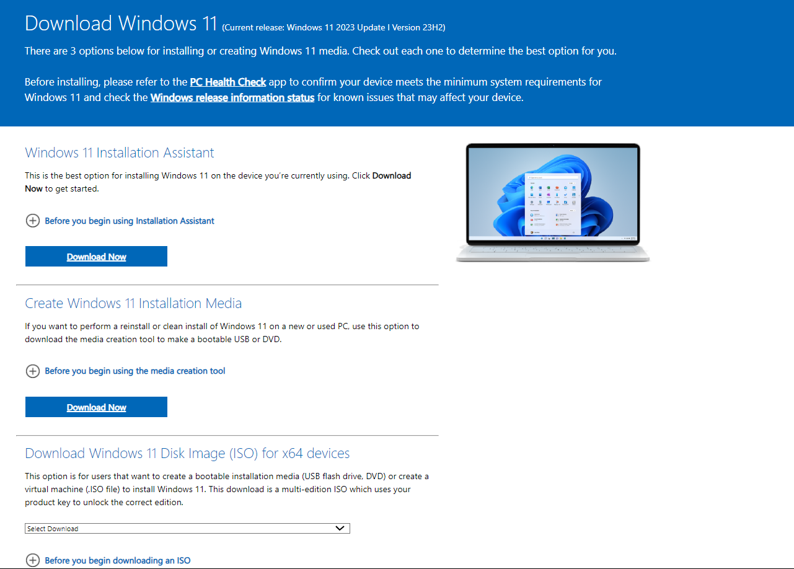

2. Install a Text Editor or Integrated Development Environment (IDE):
   Select and install a text editor or IDE suitable for your programming languages and workflow. Download and Install Visual Studio Code. https://code.visualstudio.com/Download

   # Visual Studio Code Installation and Project Setup Guide

## Part 1: Visual Studio Code Installation

### Step-by-Step Instructions

#### Step 1: Download Visual Studio Code
1. **Visit the official Visual Studio Code download page**:
   - Go to [Visual Studio Code Download](https://code.visualstudio.com/Download).

   

2. **Select your operating system** and download the installer.

   

#### Step 2: Run the Installer
1. **Locate the downloaded file** and double-click to run the Visual Studio Code installer.

   

2. **Follow the setup wizard instructions**.
   - Click "Next" on the welcome screen.

     

   - Accept the license agreement and click "Next".

     

   - Choose the installation location and click "Next".

     

   - Select additional tasks such as creating a desktop icon and adding to PATH, then click "Next".

     

3. **Click "Install"** to begin the installation.

   

4. **Click "Finish"** once the installation is complete.

   

#### Step 3: Launch Visual Studio Code
1. **Open Visual Studio Code** from the start menu or desktop icon.

   

2. **Explore the welcome screen** and familiarize yourself with the interface.

   

## Part 3: Reflection on Challenges and Solutions

### Challenges Faced

1. **Compatibility Issues**:
   - Ensuring Visual Studio Code and Git were correctly installed and configured.

2. **Initial Setup**:
   - Configuring Visual Studio Code for the first time and setting up the project environment.

3. **Understanding Git Commands**:
   - For beginners, understanding and using Git commands correctly posed an initial challenge.

### Strategies to Overcome Challenges

1. **Research and Preparation**:
   - Conducted thorough research on installation and configuration processes using official documentation.

2. **Utilized Visual Studio Code Extensions**:
   - Used extensions like GitLens to simplify Git operations within Visual Studio Code.

3. **Learning Resources**:
   - Leveraged online tutorials and documentation from Git and Visual Studio Code’s official websites to understand and practice Git commands effectively.

### Tools Selected
- **Visual Studio Code**: Chosen for its powerful features, flexibility, and extensive extension support.
- **Git**: Essential for version control and collaboration.
- **GitHub**: Provides a reliable platform for hosting and managing repositories.

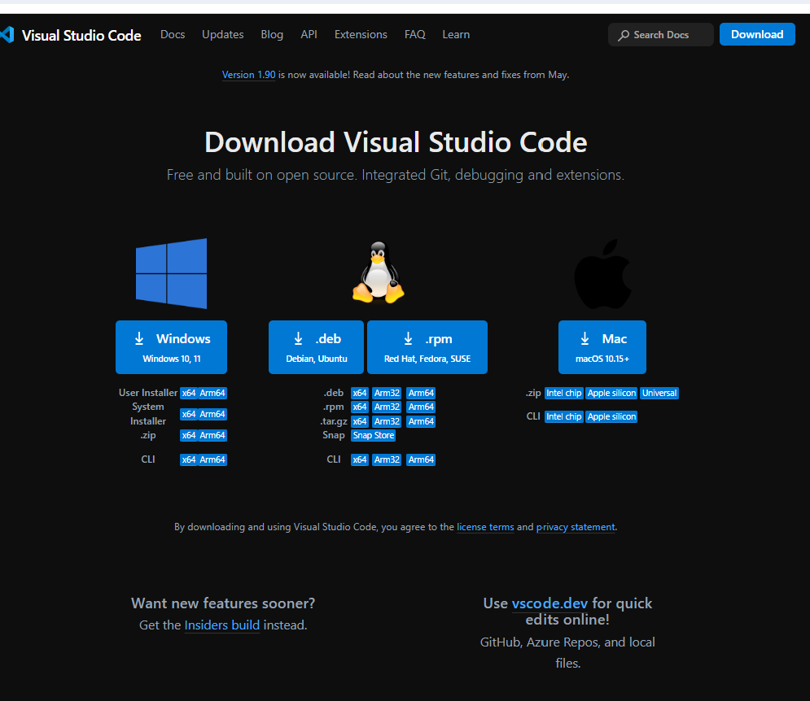

3. Set Up Version Control System:
   Install Git and configure it on your local machine. Create a GitHub account for hosting your repositories. Initialize a Git repository for your project and make your first commit. https://github.com

# Git and GitHub Setup Guide

## Part 1: Git Installation and Configuration

### Step-by-Step Instructions

#### Step 1: Download Git
1. **Visit the official Git download page**:
   - Go to [Git Download](https://git-scm.com/download/win).
   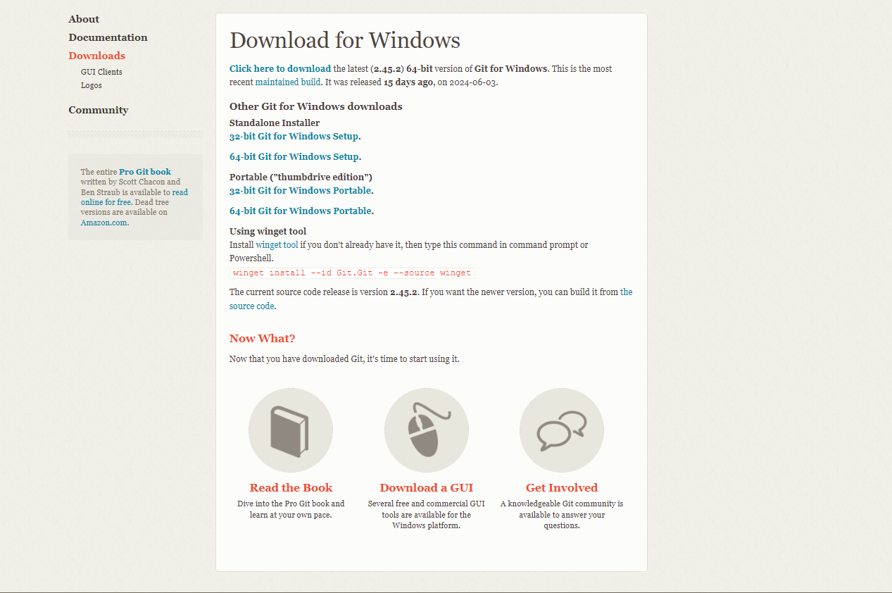

   

2. **Select your operating system** and download the installer.

   

#### Step 2: Run the Git Installer
1. **Locate the downloaded file** and double-click to run the Git installer.

   

2. **Follow the setup wizard instructions**.
   - Click "Next" on the welcome screen.

     

   - Select the installation location and click "Next".

     

   - Choose your preferred components and click "Next".

     

   - Select the default editor used by Git. If unsure, choose "Use Visual Studio Code as Git's default editor".

     

   - Choose the initial branch name. Typically, "main" is used.

     

   - Select the preferred HTTPS transport backend and click "Next".

     

   - Configure the line ending conversions. The default setting is recommended.

     

   - Choose the terminal emulator. The default is "Use MinTTY (the default terminal of MSYS2)".

     

   - Click "Install" to begin the installation.

     

3. **Click "Finish"** once the installation is complete.

   

#### Step 3: Configure Git
1. **Open Git Bash**.

   

2. **Set your username**:
   ```bash
   git config --global user.name "Your Name"
   ```
   

3. **Set your email**:
   ```bash
   git config --global user.email "your-email@example.com"
   ```
   

#### Step 4: Verify Configuration
1. **Check the configuration settings**:
   ```bash
   git config --list
   ```
   

## Part 2: GitHub Account Setup

### Step-by-Step Instructions

#### Step 1: Create a GitHub Account
1. **Visit the GitHub website**:
   - Go to [GitHub](https://github.com).

   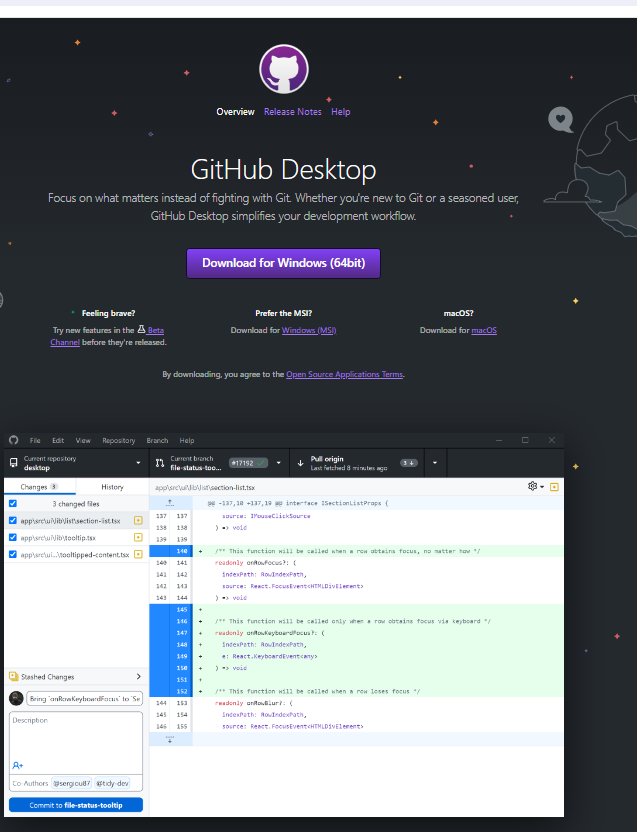

   

2. **Click on "Sign up"**.

   

3. **Enter your details** and follow the prompts to create your account.

   

#### Step 2: Verify Your Email
1. **Check your email for a verification link from GitHub**.
2. **Click the verification link** to verify your email address.

   

#### Step 3: Create a New Repository
1. **Click on "New repository"** from the GitHub homepage or your profile.

   

2. **Enter the repository name** and description (optional).

   

3. **Choose the repository visibility** (public or private).

   

4. **Click "Create repository"**.

   

## Part 3: Initialize a Git Repository and Make the First Commit

### Step-by-Step Instructions

#### Step 1: Initialize a Git Repository
1. **Create a new project directory**.
2. **Open Git Bash** in the project directory.

   

3. **Initialize a new Git repository**:
   ```bash
   git init
   ```
   

#### Step 2: Create a Sample Project File
1. **Create a sample file**, e.g., `README.md`, and add some initial content.

   

#### Step 3: Create a .gitignore File
1. **In the root of your project directory**, create a `.gitignore` file with the following content:
   ```
   # Ignore node_modules folder
   node_modules/

   # Ignore logs
   *.log
   ```

   

#### Step 4: Commit the Initial Project Files
1. **Add your files to the repository**:
   ```bash
   git add .
   ```
   

2. **Commit the changes**:
   ```bash
   git commit -m "Initial commit"
   ```
   

#### Step 5: Link the Local Repository to GitHub
1. **Copy the repository URL** from the GitHub repository page.

   

2. **In Git Bash**, add the remote repository:
   ```bash
   git remote add origin <repository-url>
   ```
   

3. **Push your changes to GitHub**:
   ```bash
   git push -u origin main
   ```
   

### GitHub Repository Contents
- `README.md`: Contains basic information about the project.
- `.gitignore`: Ensures unnecessary files are not tracked by Git.

## Part 4: Reflection on Challenges and Solutions

### Challenges Faced

1. **Understanding Git Commands**:
   - For beginners, understanding and using Git commands correctly posed an initial challenge.

2. **Configuring Git**:
   - Ensuring Git was correctly configured with the user's information.

3. **Connecting to GitHub**:
   - Properly linking the local repository to GitHub and managing SSH keys for authentication.

### Strategies to Overcome Challenges

1. **Learning Resources**:
   - Leveraged online tutorials and documentation from Git and GitHub’s official websites to understand and practice Git commands effectively.

2. **Step-by-Step Guides**:
   - Followed detailed guides and used Visual Studio Code’s integrated terminal to simplify the setup process.

3. **Practice and Patience**:
   - Practiced using Git commands in different scenarios to become more comfortable with version control.

### Tools Selected
- **Git**: Essential for version control and collaboration.
- **GitHub**: Provides a reliable platform for hosting and managing repositories.


4. Install Necessary Programming Languages and Runtimes:
  Instal Python from http://wwww.python.org programming language required for your project and install their respective compilers, interpreters, or runtimes. Ensure you have the necessary tools to build and execute your code.

  # Python Installation and Setup Guide

## Part 1: Download and Install Python

### Step-by-Step Instructions

#### Step 1: Download Python
1. **Visit the official Python website**:
   - Go to [Python Downloads](https://www.python.org/downloads/).

   

2. **Click on the "Download Python" button** to get the latest version.

   

#### Step 2: Run the Python Installer
1. **Locate the downloaded file** and double-click to run the Python installer.

   

2. **Ensure you check the box "Add Python to PATH"** before clicking "Install Now".

   

3. **Click "Install Now"** to begin the installation.

   

4. **Wait for the installation to complete**, and then click "Close".

   

#### Step 3: Verify Python Installation
1. **Open a command prompt** or PowerShell.

   

2. **Verify the installation** by typing the following commands:
   ```bash
   python --version
   pip --version
   ```
   

## Part 2: Setting Up Python Environment

### Step-by-Step Instructions

#### Step 1: Install Virtualenv
1. **In your command prompt or PowerShell**, install `virtualenv` using `pip`:
   ```bash
   pip install virtualenv
   ```
   

#### Step 2: Create a Virtual Environment
1. **Navigate to your project directory** or create a new one.
2. **Create a virtual environment**:
   ```bash
   virtualenv venv
   ```
   

#### Step 3: Activate the Virtual Environment
1. **Activate the virtual environment**:
   - On Windows:
     ```bash
     .\venv\Scripts\activate
     ```
   - On macOS and Linux:
     ```bash
     source venv/bin/activate
     ```
   

2. **Verify the virtual environment is active**. Your command prompt should now show `(venv)` at the beginning.

   

#### Step 4: Install Required Packages
1. **Create a `requirements.txt` file** in your project directory with the necessary packages. For example:
   ```
   requests
   numpy
   ```

   

2. **Install the packages** listed in `requirements.txt`:
   ```bash
   pip install -r requirements.txt
   ```
   

## Part 3: Initialize a Git Repository and Make the First Commit

### Step-by-Step Instructions

#### Step 1: Initialize a Git Repository
1. **In your project directory**, initialize a new Git repository:
   ```bash
   git init
   ```
   

#### Step 2: Create a .gitignore File
1. **Create a `.gitignore` file** in the root of your project directory with the following content:
   ```
   # Ignore virtual environment
   venv/

   # Ignore Python bytecode
   __pycache__/
   *.py[cod]

   # Ignore logs
   *.log
   ```

   

#### Step 3: Commit the Initial Project Files
1. **Add your files to the repository**:
   ```bash
   git add .
   ```
   

2. **Commit the changes**:
   ```bash
   git commit -m "Initial commit"
   ```
   

## Part 4: Reflection on Challenges and Solutions

### Challenges Faced

1. **Installation Errors**:
   - Encountered issues with incorrect PATH configurations and permission errors during installation.

2. **Virtual Environment Setup**:
   - Understanding the need for virtual environments and correctly setting them up.

3. **Package Management**:
   - Ensuring all required packages were correctly listed and installed without conflicts.

### Strategies to Overcome Challenges

1. **Thorough Research**:
   - Leveraged official documentation and community forums to understand and resolve installation issues.

2. **Step-by-Step Approach**:
   - Followed detailed guides to set up the virtual environment and manage dependencies.

3. **Practice and Verification**:
   - Regularly verified each step of the setup process to ensure correctness and addressed any issues promptly.

### Tools Selected
- **Python**: Chosen for its simplicity, extensive libraries, and suitability for various types of projects.
- **Virtualenv**: Used to create isolated Python environments, preventing conflicts between project dependencies.

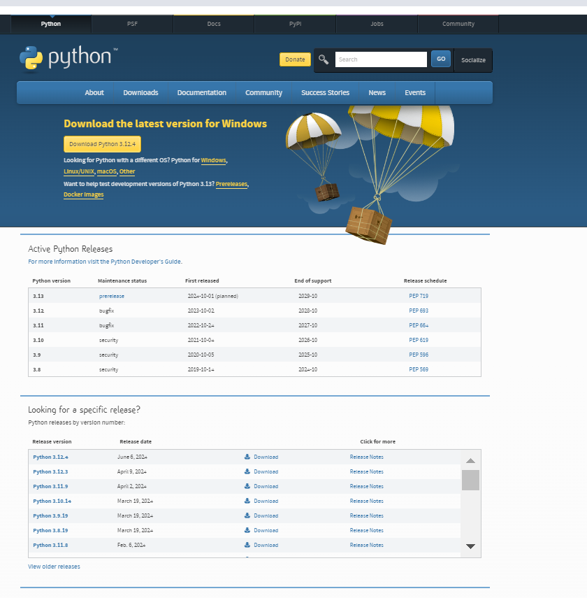


5. Install Package Managers:
   If applicable, install package managers like pip (Python).

   # Installing Python Package Managers

## Part 1: Installing pip for Python

### Step-by-Step Instructions

#### Step 1: Verify pip Installation
1. **Open a command prompt** or PowerShell.
2. **Check if pip is already installed**:
   ```bash
   pip --version
   ```
   
   - If pip is installed, you will see the version number.

#### Step 2: Download get-pip.py
1. **Download the `get-pip.py` script** from the official Python website:
   - Go to [get-pip.py](https://bootstrap.pypa.io/get-pip.py).
   - Alternatively, download it directly via this [link](https://bootstrap.pypa.io/get-pip.py).

   

2. **Save the file** to a known location on your system.

#### Step 3: Run get-pip.py
1. **Navigate to the location where you saved `get-pip.py`** using the command prompt.
   ```bash
   cd path\to\directory
   ```
   

2. **Run the script to install pip**:
   ```bash
   python get-pip.py
   ```
   

#### Step 4: Verify pip Installation
1. **Check if pip is installed**:
   ```bash
   pip --version
   ```
   

### Troubleshooting Common Issues
- **Issue**: `'python' is not recognized as an internal or external command`
  - **Solution**: Ensure Python is added to your system's PATH. Re-run the Python installer and check the "Add Python to PATH" option.

- **Issue**: `pip` command not found after installation
  - **Solution**: Close and reopen your command prompt. Verify that the Scripts directory (e.g., `C:\Python39\Scripts`) is included in your PATH environment variable.

## Part 2: Using pip to Manage Packages

### Step-by-Step Instructions

#### Step 1: Installing a Package
1. **Install a package using pip**:
   ```bash
   pip install requests
   ```
   

2. **Verify the installation** by importing the package in Python:
   ```bash
   python -c "import requests; print(requests.__version__)"
   ```
   

#### Step 2: Creating a requirements.txt File
1. **List installed packages** and their versions:
   ```bash
   pip freeze > requirements.txt
   ```
   

2. **View the `requirements.txt` file** to ensure it contains the list of packages.

   

#### Step 3: Installing Packages from requirements.txt
1. **Install packages from a `requirements.txt` file**:
   ```bash
   pip install -r requirements.txt
   ```
   

### Reflection on Challenges and Solutions

#### Challenges Faced

1. **Installation Errors**:
   - Encountered issues with incorrect PATH configurations and permission errors during installation.

2. **Understanding pip Commands**:
   - For beginners, understanding and using pip commands correctly posed an initial challenge.

3. **Managing Dependencies**:
   - Ensuring all required packages were correctly listed and installed without conflicts.

#### Strategies to Overcome Challenges

1. **Thorough Research**:
   - Leveraged official documentation and community forums to understand and resolve installation issues.

2. **Step-by-Step Approach**:
   - Followed detailed guides to install pip and manage dependencies effectively.

3. **Practice and Verification**:
   - Regularly verified each step of the setup process to ensure correctness and addressed any issues promptly.

### Tools Selected
- **pip**: Chosen for its simplicity and wide acceptance as the default package manager for Python, making it suitable for managing project dependencies.

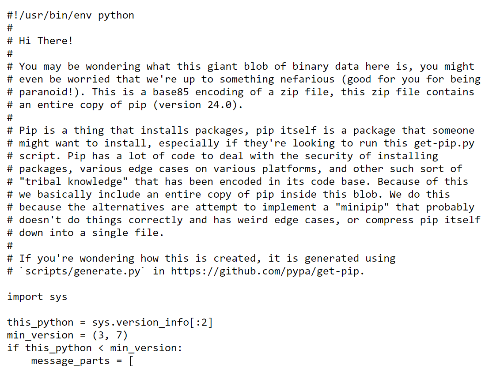
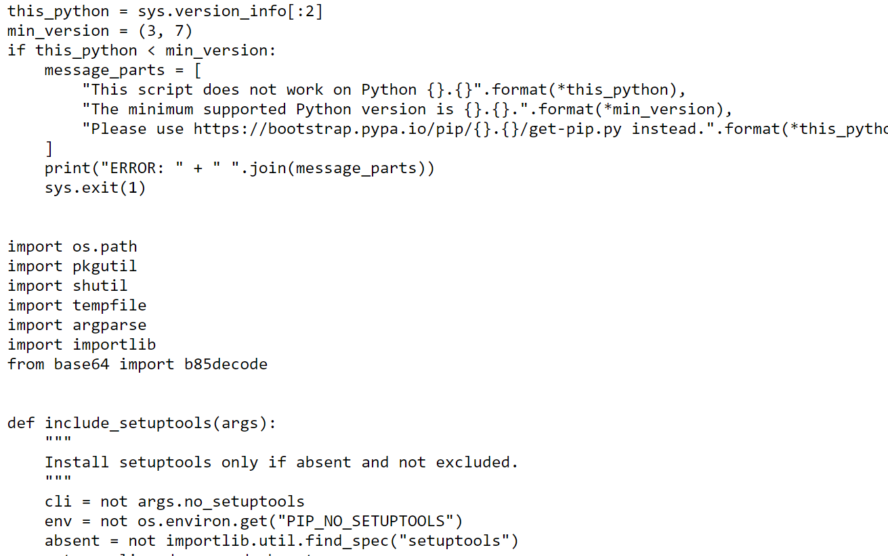
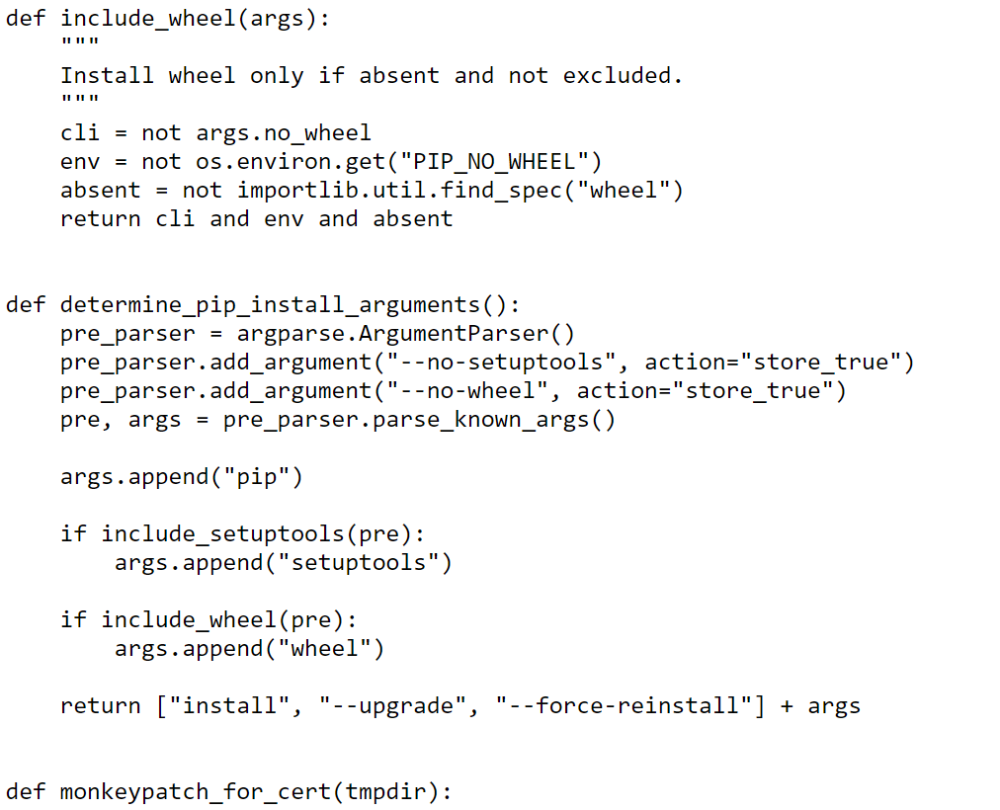
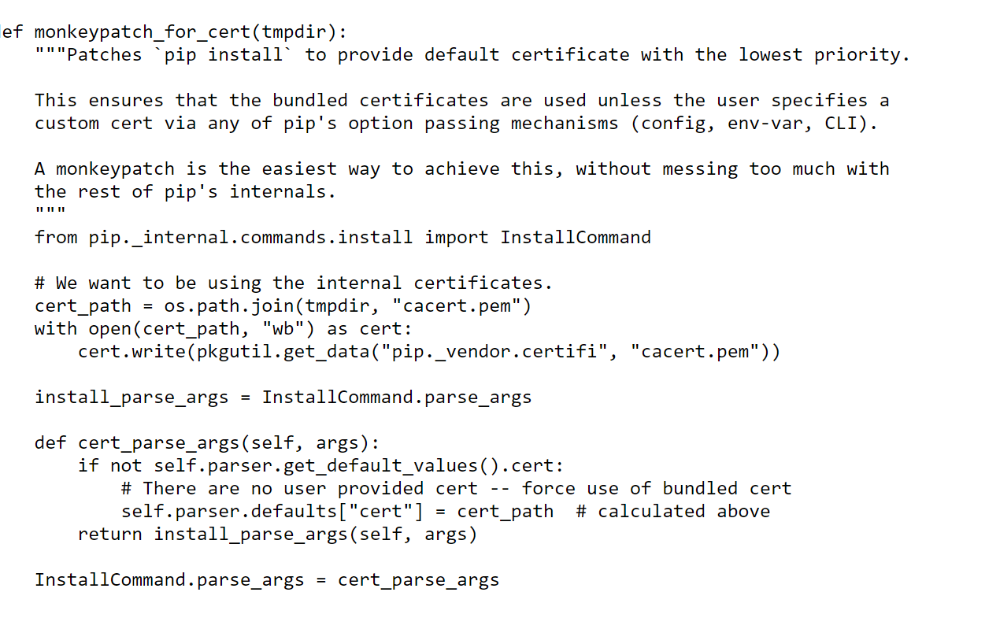
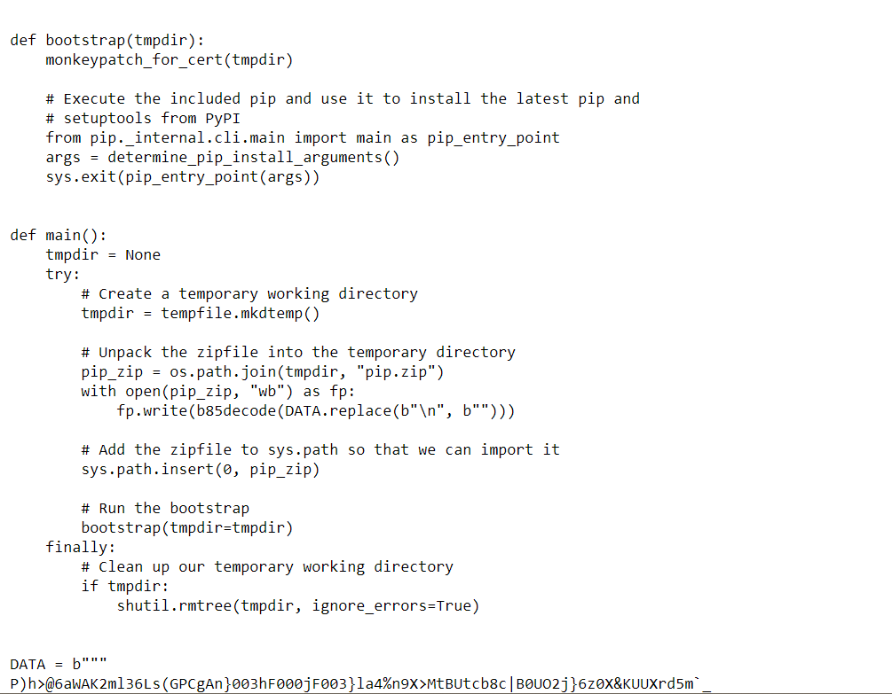
6. Configure a Database (MySQL):
   Download and install MySQL database. https://dev.mysql.com/downloads/windows/installer/5.7.html

   # MySQL Installation and Setup Guide

## Part 1: Download and Install MySQL

### Step-by-Step Instructions

#### Step 1: Download MySQL Installer
1. **Visit the official MySQL download page**:
   - Go to [MySQL Downloads](https://dev.mysql.com/downloads/windows/installer/5.7.html).

   

2. **Select "MySQL Installer for Windows"** and click on the "Download" button.

   

3. **Choose the appropriate version** and click on "Download".

   

#### Step 2: Run the MySQL Installer
1. **Locate the downloaded file** and double-click to run the MySQL installer.

   

2. **Choose the setup type**. For most users, "Developer Default" is recommended. Click "Next".

   

3. **Check for requirements**. The installer will check for any missing prerequisites. Click "Execute" to install them if necessary.

   

4. **Proceed through the installation** steps by clicking "Next" and then "Execute".

   

5. **Once the installation is complete**, click "Next".

   

#### Step 3: Configure MySQL Server
1. **Start the MySQL server configuration** by clicking "Next".

   

2. **Choose the server type**. For most users, "Standalone MySQL Server" is recommended. Click "Next".

   

3. **Configure the MySQL server** by setting the port and the networking options. The default settings are usually sufficient. Click "Next".

   

4. **Set the root password** and create any additional user accounts if necessary. Click "Next".

   

5. **Configure the Windows service** by ensuring the "Start the MySQL Server at System Startup" option is selected. Click "Next".

   

6. **Apply the configuration** by clicking "Execute".

   

7. **Once the configuration is complete**, click "Finish".

   

#### Step 4: Verify MySQL Installation
1. **Open the MySQL Command Line Client**.

   

2. **Enter the root password** that you set during the configuration.

   

3. **Verify the installation** by running a simple query:
   ```sql
   SHOW DATABASES;
   ```
   

## Part 2: Using MySQL Workbench

### Step-by-Step Instructions

#### Step 1: Open MySQL Workbench
1. **Launch MySQL Workbench** from the Start Menu.

   

#### Step 2: Create a New Database
1. **Click on "Create a new schema in the connected server"**.

   

2. **Enter the schema name** and click "Apply".

   

3. **Review the SQL script** and click "Apply".

   

4. **Click "Finish"**.

   

#### Step 3: Create a Table
1. **In the Navigator pane**, right-click on the new schema and select "Create Table".

   

2. **Enter the table name** and define the columns. Click "Apply".

   

3. **Review the SQL script** and click "Apply".

   

4. **Click "Finish"**.

   

## Part 3: Initialize a Git Repository and Make the First Commit

### Step-by-Step Instructions

#### Step 1: Initialize a Git Repository
1. **In your project directory**, initialize a new Git repository:
   ```bash
   git init
   ```
   

#### Step 2: Create a .gitignore File
1. **Create a `.gitignore` file** in the root of your project directory with the following content:
   ```
   # Ignore MySQL configuration files
   *.ini
   *.cnf

   # Ignore MySQL data directory
   data/
   ```

   

#### Step 3: Commit the Initial Project Files
1. **Add your files to the repository**:
   ```bash
   git add .
   ```
   

2. **Commit the changes**:
   ```bash
   git commit -m "Initial commit"
   ```
   

## Part 4: Reflection on Challenges and Solutions

### Challenges Faced

1. **Installation Errors**:
   - Encountered issues with missing prerequisites and permission errors during installation.

2. **Configuration Complexity**:
   - Understanding and correctly configuring the MySQL server and user accounts.

3. **Database Management**:
   - Ensuring the database and tables are correctly set up and managed.

### Strategies to Overcome Challenges

1. **Thorough Research**:
   - Leveraged official documentation and community forums to understand and resolve installation and configuration issues.

2. **Step-by-Step Approach**:
   - Followed detailed guides to install and configure MySQL effectively.

3. **Practice and Verification**:
   - Regularly verified each step of the setup process to ensure correctness and addressed any issues promptly.

### Tools Selected
- **MySQL**: Chosen for its reliability, ease of use, and suitability for various types of projects.

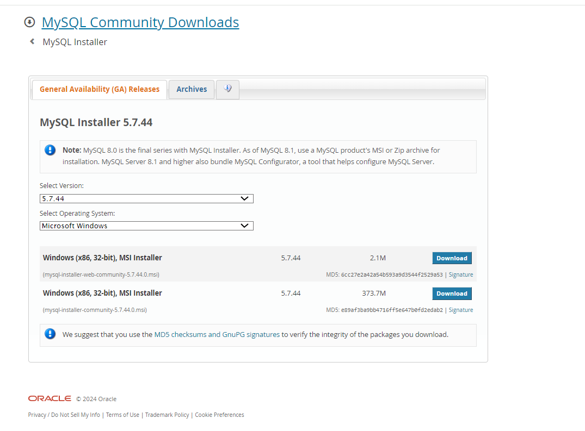


7. Set Up Development Environments and Virtualization (Optional):
   Consider using virtualization tools like Docker or virtual machines to isolate project dependencies and ensure consistent environments across different machines.

# Setting Up Development Environments and Virtualization with Docker

## Part 1: Installing Docker

### Step-by-Step Instructions

#### Step 1: Download Docker Desktop
1. **Visit the Docker Desktop download page**:
   - Go to [Docker Desktop Downloads](https://www.docker.com/products/docker-desktop).

   

2. **Click "Download for Windows"**.

   

#### Step 2: Install Docker Desktop
1. **Locate the downloaded file** and double-click to run the Docker Desktop installer.

   

2. **Follow the installation prompts**. Ensure you check the option "Enable WSL 2 Features" if you plan to use Windows Subsystem for Linux (WSL).

   

3. **Click "Install"** and wait for the installation to complete.

   

4. **Click "Close"** and restart your computer if prompted.

   

#### Step 3: Verify Docker Installation
1. **Open Docker Desktop** from the Start Menu.

   

2. **Verify Docker is running** by checking the Docker icon in the system tray.

   

3. **Open a command prompt** and run the following command to verify the installation:
   ```bash
   docker --version
   ```
   

## Part 2: Setting Up a Dockerized Development Environment

### Step-by-Step Instructions

#### Step 1: Create a Dockerfile
1. **Create a new directory for your project** and navigate into it:
   ```bash
   mkdir myproject
   cd myproject
   ```

2. **Create a `Dockerfile`** in the root of your project directory with the following content:
   ```Dockerfile
   # Use the official Python image from the Docker Hub
   FROM python:3.9-slim

   # Set the working directory in the container
   WORKDIR /app

   # Copy the current directory contents into the container at /app
   COPY . /app

   # Install any needed packages specified in requirements.txt
   RUN pip install --no-cache-dir -r requirements.txt

   # Make port 80 available to the world outside this container
   EXPOSE 80

   # Define environment variable
   ENV NAME World

   # Run app.py when the container launches
   CMD ["python", "app.py"]
   ```

   

#### Step 2: Create a requirements.txt File
1. **Create a `requirements.txt` file** with the necessary dependencies:
   ```txt
   Flask
   ```

   

#### Step 3: Create a Simple Flask Application
1. **Create an `app.py` file** with a simple Flask application:
   ```python
   from flask import Flask
   app = Flask(__name__)

   @app.route('/')
   def hello_world():
       return 'Hello, Docker World!'

   if __name__ == '__main__':
       app.run(host='0.0.0.0', port=80)
   ```

   

#### Step 4: Build and Run the Docker Container
1. **Build the Docker image**:
   ```bash
   docker build -t myflaskapp .
   ```

   

2. **Run the Docker container**:
   ```bash
   docker run -p 4000:80 myflaskapp
   ```

   

3. **Open a web browser** and navigate to `http://localhost:4000` to see the running Flask application.

   

## Part 3: Initialize a Git Repository and Make the First Commit

### Step-by-Step Instructions

#### Step 1: Initialize a Git Repository
1. **In your project directory**, initialize a new Git repository:
   ```bash
   git init
   ```
   

#### Step 2: Create a .gitignore File
1. **Create a `.gitignore` file** in the root of your project directory with the following content:
   ```
   # Ignore Python bytecode
   __pycache__/
   *.py[cod]

   # Ignore virtual environment
   venv/

   # Ignore Docker files
   *.tar
   *.bak
   *.log
   ```

   

#### Step 3: Commit the Initial Project Files
1. **Add your files to the repository**:
   ```bash
   git add .
   ```
   

2. **Commit the changes**:
   ```bash
   git commit -m "Initial commit"
   ```
   

## Part 4: Reflection on Challenges and Solutions

### Challenges Faced

1. **Docker Installation Errors**:
   - Encountered issues with Windows Hyper-V and WSL 2 prerequisites during installation.

2. **Understanding Docker Concepts**:
   - Initial difficulty in understanding Docker concepts like images, containers, and Dockerfile syntax.

3. **Networking Issues**:
   - Faced issues with container networking and port mapping.

### Strategies to Overcome Challenges

1. **Thorough Research**:
   - Leveraged official Docker documentation, tutorials, and community forums to understand and resolve installation issues.

2. **Step-by-Step Approach**:
   - Followed detailed guides to build and run Docker containers, breaking down complex concepts into manageable steps.

3. **Practice and Verification**:
   - Regularly verified each step of the setup process to ensure correctness and addressed any issues promptly.

### Tools Selected
- **Docker**: Chosen for its ability to provide consistent development environments, ease of use, and extensive documentation and community support.

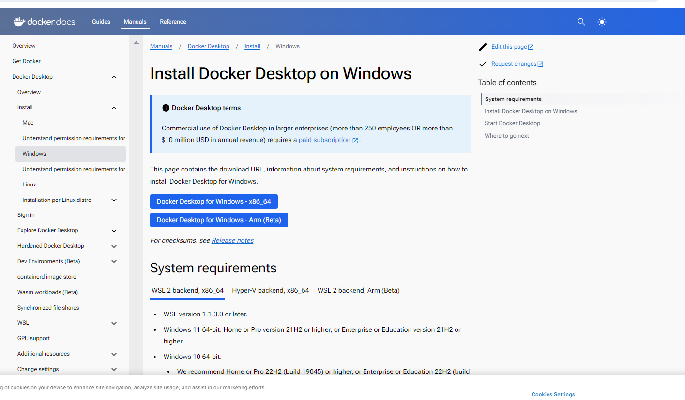
[screenshoot](image-13.png)
   
8. Explore Extensions and Plugins:
   Explore available extensions, plugins, and add-ons for your chosen text editor or IDE to enhance functionality, such as syntax highlighting, linting, code formatting, and version control integration.

# Exploring Extensions and Plugins for Visual Studio Code (VS Code)

## Part 1: Installing Extensions in VS Code

### Step-by-Step Instructions

#### Step 1: Open Visual Studio Code
1. **Launch Visual Studio Code** from the Start Menu or desktop shortcut.

   

#### Step 2: Access the Extensions Marketplace
1. **Click on the Extensions icon** in the Activity Bar on the side of the window. Alternatively, press `Ctrl+Shift+X` to open the Extensions view.

   

#### Step 3: Install Python Extension
1. **Search for the Python extension** in the Extensions Marketplace.
   - Type "Python" in the search bar.

   

2. **Install the Python extension** by Microsoft.
   - Click the "Install" button.

   

#### Step 4: Install GitLens Extension
1. **Search for the GitLens extension** in the Extensions Marketplace.
   - Type "GitLens" in the search bar.

   

2. **Install the GitLens extension**.
   - Click the "Install" button.

   

#### Step 5: Install Prettier Extension
1. **Search for the Prettier extension** in the Extensions Marketplace.
   - Type "Prettier" in the search bar.

   

2. **Install the Prettier extension**.
   - Click the "Install" button.

   

#### Step 6: Install ESLint Extension
1. **Search for the ESLint extension** in the Extensions Marketplace.
   - Type "ESLint" in the search bar.

   

2. **Install the ESLint extension**.
   - Click the "Install" button.

   

## Part 2: Configuring and Using Extensions

### Step-by-Step Instructions

#### Step 1: Configure Python Extension
1. **Open the Command Palette** by pressing `Ctrl+Shift+P`.
2. **Type "Python: Select Interpreter"** and press Enter.
3. **Choose the Python interpreter** you want to use for your project.

   

4. **Enable linting** by opening the Command Palette, typing "Python: Enable Linting", and pressing Enter.

   

#### Step 2: Configure Prettier Extension
1. **Open the Command Palette** by pressing `Ctrl+Shift+P`.
2. **Type "Preferences: Open Settings (UI)"** and press Enter.
3. **Search for "Format On Save"** and check the box to enable it.

   

4. **Set Prettier as the default formatter** by searching for "Default Formatter" and selecting "Prettier - Code formatter".

   

#### Step 3: Configure ESLint Extension
1. **Ensure you have ESLint installed** in your project:
   ```bash
   npm install eslint --save-dev
   ```

   

2. **Create an `.eslintrc.json` file** in the root of your project with the following content:
   ```json
   {
     "env": {
       "browser": true,
       "es2021": true
     },
     "extends": [
       "eslint:recommended",
       "plugin:react/recommended",
       "plugin:@typescript-eslint/recommended"
     ],
     "parser": "@typescript-eslint/parser",
     "parserOptions": {
       "ecmaFeatures": {
         "jsx": true
       },
       "ecmaVersion": 12,
       "sourceType": "module"
     },
     "plugins": [
       "react",
       "@typescript-eslint"
     ],
     "rules": {
     }
   }
   ```

   

3. **Open the Command Palette** by pressing `Ctrl+Shift+P`.
4. **Type "ESLint: Enable/Disable ESLint"** and press Enter to enable ESLint.

   

#### Step 4: Use GitLens Extension
1. **Open a project with Git initialized**.
2. **View GitLens features** in the Source Control view by clicking on the Source Control icon in the Activity Bar.

   

3. **View detailed Git information** in your code, such as line history and blame annotations.

   

## Part 3: Reflection on Challenges and Solutions

### Challenges Faced

1. **Extension Compatibility**:
   - Encountered issues with certain extensions conflicting with each other or not working as expected in some environments.

2. **Configuration Complexity**:
   - Initial difficulty in understanding the various settings and configurations required for each extension.

3. **Performance Issues**:
   - Some extensions caused performance slowdowns, especially in larger projects.

### Strategies to Overcome Challenges

1. **Thorough Research**:
   - Utilized official documentation and community forums to resolve compatibility issues and understand the required configurations.

2. **Step-by-Step Approach**:
   - Followed detailed guides to configure each extension, ensuring settings were applied correctly and tested thoroughly.

3. **Selective Installation**:
   - Installed and tested extensions incrementally to identify and resolve any performance issues or conflicts early.

### Tools Selected
- **Python Extension**: For Python development, including linting, debugging, and IntelliSense.
- **GitLens**: For enhanced Git integration, providing detailed insights into code history and collaboration.
- **Prettier**: For consistent code formatting across different languages and projects.
- **ESLint**: For JavaScript and TypeScript linting, ensuring code quality and adherence to coding standards.


9. Document Your Setup:
    Create a comprehensive document outlining the steps you've taken to set up your developer environment. Include any configurations, customizations, or troubleshooting steps encountered during the process. 

    [text](<../Users/user/OneDrive/Desktop/Comprehensive Documentation for Setting Up Devel.docx>)   "C:<..\Users\user\OneDrive\Desktop\Comprehensive Documentation for Setting Up Devel.docx"
   

#Deliverables:
- Document detailing the setup process with step-by-step instructions and screenshots where necessary.
- A GitHub repository containing a sample project initialized with Git and any necessary configuration files (e.g., .gitignore).
- A reflection on the challenges faced during setup and strategies employed to overcome them.

#Submission:
Submit your document and GitHub repository link through the designated platform or email to the instructor by the specified deadline.

#Evaluation Criteria:**
- Completeness and accuracy of setup documentation.
- Effectiveness of version control implementation.
- Appropriateness of tools selected for the project requirements.
- Clarity of reflection on challenges and solutions encountered.
- Adherence to submission guidelines and deadlines.

Note: Feel free to reach out for clarification or assistance with any aspect of the assignment.
